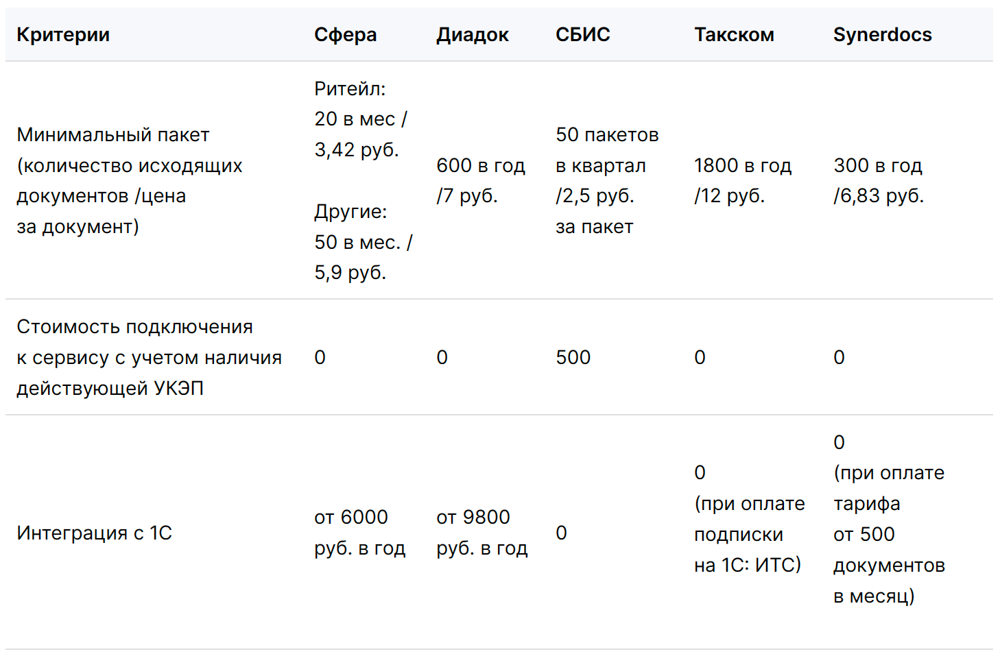

# Конкурентный анализ

Сегодня на рынке Электронного документооборота (ЭДО) можно можно выделить

* ООО «КОРУС Консалтинг СНГ»	
* ЗАО «ПФ «СКБ Контур».	
* ООО «Тензор»	
* ООО «Такском»	
* ООО «ДИРЕКТУМ»

### Возможности сервиса

### Интеграция с системами

### Подключение контрагентов и роуминг

### Стоимость

